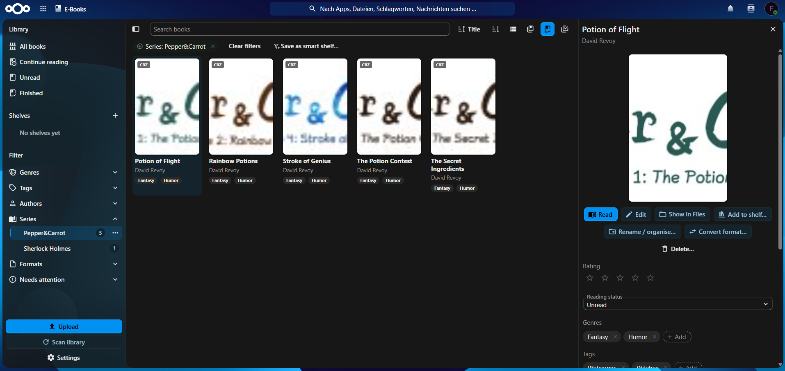
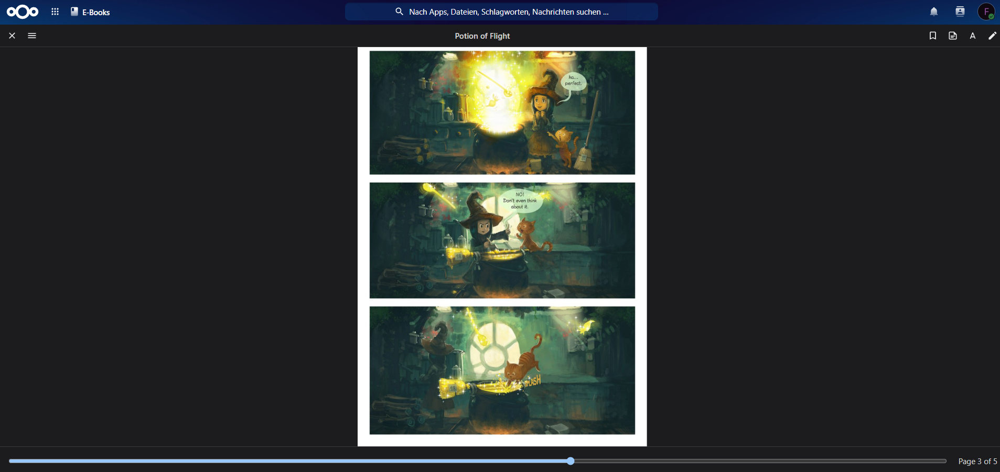
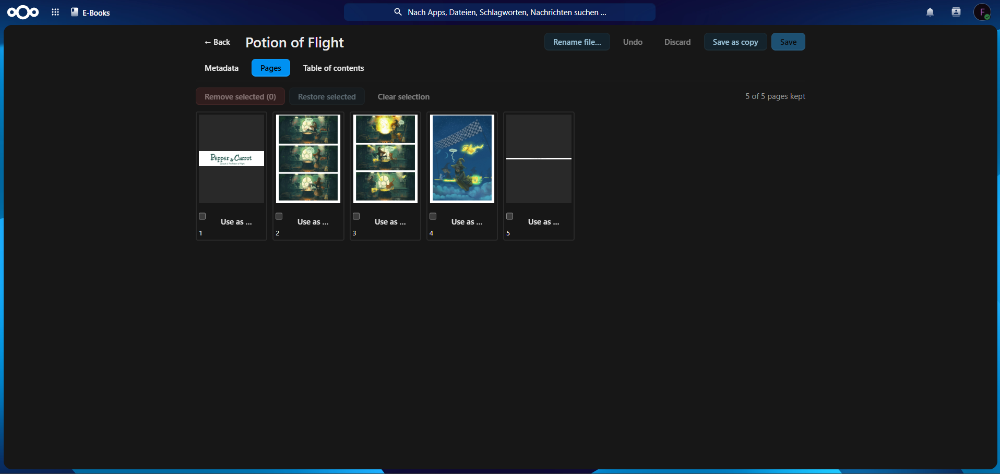

🇬🇧 **English** | [🇩🇪 Deutsch](docs/translations/README.de.md)

# E-Book Reader for Nextcloud

E-Book Reader is a library, reader and editor for e-books and comics inside Nextcloud. Your books stay ordinary files in your Nextcloud storage: the app indexes them, presents them as a browsable library, and keeps your reading position in sync across all your devices.

It is a regular Nextcloud app (PHP backend, Vue frontend). It needs no extra container, database or external service; optional archive tools on the server (7-Zip, bsdtar) enable server-side handling of RAR and 7z comics.

[](https://github.com/SomeCatCode/nextcloud_ebook_reader/actions/workflows/ci.yml)
[](https://github.com/SomeCatCode/nextcloud_ebook_reader/releases)








<sub>Screenshots show [Pepper&amp;Carrot](https://www.peppercarrot.com) by David Revoy, licensed under [CC BY 4.0](https://creativecommons.org/licenses/by/4.0/).</sub>

> [!NOTE]
> **Beta.** The app is in daily production use with a large library (e-books and comics up to 400 MB) and covered by automated tests. Details may still change before 1.0. The editor modifies files; Nextcloud keeps a version of every change, but a backup of your books is still a good idea.

## Requirements

- Nextcloud 34
- PHP 8.2 or later with `zip`, `gd`, `dom`, `libxml`, `mbstring` (included in common installations and the official Docker image)
- Background jobs via **cron** (recommended; with AJAX, large libraries are indexed slowly)
- Optional: **7-Zip** and/or **bsdtar** for CBR and CB7 comics on the server, see [Archive tools](#archive-tools-optional)
- A current Firefox, Chrome/Edge or Safari

## Installation

The app is not yet in the Nextcloud App Store. Install it from a release package:

```sh
cd /var/www/nextcloud/custom_apps
curl -L https://github.com/SomeCatCode/nextcloud_ebook_reader/releases/latest/download/ebookreader.tar.gz | tar -xz
chown -R www-data:www-data ebookreader
sudo -u www-data php /var/www/nextcloud/occ app:enable ebookreader
```

Each release also ships `ebookreader.tar.gz.sha256` for verification (`sha256sum -c ebookreader.tar.gz.sha256`).

**Docker (official image).** The app belongs in `/var/www/html/custom_apps/ebookreader` inside the Nextcloud container and must be owned by `www-data` (`nextcloud` is the container name):

```sh
curl -LO https://github.com/SomeCatCode/nextcloud_ebook_reader/releases/latest/download/ebookreader.tar.gz && tar -xzf ebookreader.tar.gz
docker cp ebookreader nextcloud:/var/www/html/custom_apps/
docker exec -u root nextcloud chown -R www-data:www-data /var/www/html/custom_apps/ebookreader
docker exec -u www-data nextcloud php occ app:enable ebookreader
```

The official image does not run cron by itself; add a service with the same volumes:

```yaml
  cron:
    image: nextcloud:34-apache
    entrypoint: /cron.sh
    volumes:
      - nextcloud:/var/www/html
```

**Nextcloud All-in-One.** Same commands with the container `nextcloud-aio-nextcloud`; cron and permissions are already set up.

**From source.** Requires Node.js 22 or later; no Composer packages are needed at runtime.

```sh
cd /var/www/nextcloud/custom_apps && git clone https://github.com/SomeCatCode/nextcloud_ebook_reader.git ebookreader
cd ebookreader && npm ci && npm run build
sudo -u www-data php /var/www/nextcloud/occ app:enable ebookreader
```

**Updating.** Replace the app folder with the new release, then run the migrations (prefix with `docker exec -u www-data <container>` on Docker):

```sh
sudo -u www-data php occ upgrade
```

### Getting started

1. Put your books into **`/Books`** (default). Other or multiple folders can be chosen in the app settings (bottom left).
2. Click **Scan library** once. Afterwards new, changed and deleted books are picked up automatically.
3. Click a book and choose **Read**, or open it directly from the Files app.

### Archive tools (optional)

CBZ and CBT are handled in PHP. For **CBR** (RAR) and **CB7** (7z) the server needs an archive tool for covers, metadata, page-by-page streaming and conversion; without one, the browser unpacks these files itself (and asks first for files over 50 MB).

The app looks for `unrar`, then `7zz`/`7z`/`7za`, then `bsdtar`, and uses the first one that can read the archive. Recommended: **7-Zip** plus **bsdtar** (libarchive), which reads RAR4 and RAR5 even where the 7-Zip package was built without RAR support (Alpine's `7zip`, used by AIO).

| Setup | How |
|---|---|
| Debian / Ubuntu | `apt install 7zip libarchive-tools` (optionally `unrar` from `non-free`) |
| Alpine | `apk add 7zip libarchive-tools` |
| Official Docker image | build your own image, see below |
| Nextcloud AIO | set `NEXTCLOUD_ADDITIONAL_APKS=imagemagick 7zip libarchive-tools` on the mastercontainer (keep `imagemagick`, it is the default), recreate it, then restart the containers from the AIO interface |

Packages installed with `docker exec` disappear when the container is recreated. For the official image, use a `Dockerfile` next to your `docker-compose.yml`:

```dockerfile
FROM nextcloud:34-apache
RUN apt-get update \
 && apt-get install -y --no-install-recommends 7zip libarchive-tools \
 && rm -rf /var/lib/apt/lists/*
```

…and replace `image:` with `build: .` and `pull_policy: build` for **both** the `app` and the `cron` service, then `docker compose build --pull && docker compose up -d` (also after every Nextcloud update).

Check what is available, then re-read books that were indexed before the tool was installed:

```sh
docker exec nextcloud-aio-nextcloud sh -c 'command -v 7zz 7z bsdtar unrar'
sudo -u www-data php occ ebookreader:scan <user> --force --format=cbr
```

## Features

**Reading**
- EPUB 2/3, MOBI, AZW3 (KF8), FB2, FB2.ZIP and the comic formats CBZ, CBR, CB7, CBT
- Opens from the Files app; paginated or scrolled layout, light/sepia/dark themes, font, size and line height
- Table of contents, full-text search, keyboard, tap zones and swipe gestures
- Comics as single or double pages, right-to-left (manga) reading direction
- Highlights in five colours, notes and bookmarks (also for comics), listed in a side panel and exportable as Markdown
- Large files open fast: comic pages are streamed one by one and scaled on the server, EPUBs are loaded chapter by chapter
- Reading position stored on the server; a newer position from another device is offered when you open a book

**Library**
- Cover grid or list with progress and a "Continue reading" row; finished books are hidden by default
- Browse by genre, tag, author, series and format; hierarchical genres and tags (`Fantasy/High Fantasy`)
- Combinable filters (include/exclude, match all or any) with search and sort, kept in the URL
- "Needs attention" view for books without genre, tags, author, series, description, cover or language
- Manual shelves with custom order and smart shelves based on a saved filter
- Series grouping with volume count and progress
- Bulk editing of authors, series (with automatic numbering), publisher, language, genres and tags; bulk shelving, renaming and deleting (to the trash)
- Drag-and-drop upload, including very large files
- Star ratings and read status
- Completion status per book (ongoing or completed) and an optional age rating (0, 6, 12, 16, 18; read from ComicInfo.xml `AgeRating` or EPUB `schema:typicalAgeRange`, or set by hand), both shown on the cards and filterable
- "Continue the series": the next volume appears in "Continue reading" once a volume is finished, and the reader offers it at the end of a book
- "Continue reading" dashboard widget and an [OPDS catalog](#opds-catalog) for e-reader apps

**Editing**
- Metadata: title, authors, series and index, description, genres, tags, language, publisher, date, ISBN
- Replace the cover (upload, or use a page)
- Remove and reorder chapters or pages, edit the table of contents
- Rename and sort into folders by pattern, e.g. `{author}/{series}/{series_index:2} - {title}`, with a preview
- Convert between CBZ, CB7, CBT and fixed-layout EPUB, with the pros and cons of each format explained (CBR cannot be a target: writing RAR requires proprietary software)
- Optional, lossy image optimization for comics (downscale pages to 2560 or 1920 px, PNG to JPEG), with a size estimate and bulk mode
- Save or save as copy; long operations continue on the server with a progress indicator

| | EPUB | CBZ | FB2 | CBR / CB7 / CBT | MOBI / AZW3 |
|---|:-:|:-:|:-:|:-:|:-:|
| Metadata, genres, tags | ✅ | ✅ | ✅ | ✅¹ | ✅¹ |
| Replace cover | ✅ | ✅ | ✅ | ✅² | – |
| Reorder/remove chapters or pages | ✅ | ✅ | ✅ | ✅² | – |
| Edit table of contents | ✅ | ✅ | ✅ | ✅² | – |

¹ stored in the sidecar file (see below); the book file stays untouched · ² after converting to CBZ, offered by the editor

## Where metadata is stored

The setting "Where metadata changes are stored" decides where edits go:

| Target | Effect |
|---|---|
| **Sidecar file** (default) | A small hidden file `.<book file>.opf` next to the book (Calibre-compatible OPF 2.0). Fast, works for every format, never touches the book, and travels with copies, sync and backups. |
| In the file | Written into the book itself (EPUB, CBZ, FB2, FBZ) so other readers see it; in the background or immediately. |
| Both | Sidecar immediately, book file according to the setting above. |
| Library only | Only in the app's database, e.g. for read-only folders. |

Precedence when indexing: fields edited in the app, then the sidecar, then the book's embedded metadata, then the file name. Renaming, moving, converting and deleting take the sidecar along. "Write metadata into the book file" in the book details copies the values into the book later, e.g. for Kobo or KOReader.

## OPDS catalog

E-reader apps can browse your library and download books over OPDS 1.2.

1. In the app settings, section **OPDS catalog**, enable the catalog for your account (off by default) and copy the catalog URL, e.g. `https://cloud.example.com/index.php/apps/ebookreader/opds`.
2. Create an **app password** under Nextcloud *Settings → Security* and use it with your user name in the reader app (HTTP Basic). It can be revoked at any time.

The catalog offers recently added, continue reading, all books, authors, series, genres, tags and shelves (including smart shelves), plus OpenSearch, 50 books per page, covers and downloads in the original format. Administrators can disable it for the whole server:

```sh
sudo -u www-data php occ config:app:set ebookreader opds_enabled --value=false --type=boolean
```

The feeds are validated against the OPDS specification; they should work with KOReader, Moon+ Reader, Librera, Thorium Reader, Panels and Chunky. Reports about other clients are welcome.

## Administration

| Command | Purpose |
|---|---|
| `occ ebookreader:scan <user>` / `--all` | index one or all libraries |
| `occ ebookreader:scan <user> --force [--format=cbr]` | also re-read unchanged books, e.g. after installing an archive tool |
| `occ ebookreader:inspect <path>` | print the metadata of a file as JSON (troubleshooting) |

| App config key | Default | Meaning |
|---|---|---|
| `max_edit_size_mb` | `500` | maximum file size for the editor |
| `archive_cache_mb` | `2048` | local cache for books on WebDAV, SMB or S3 storage and with server-side encryption |
| `opds_enabled` | `true` | OPDS catalog allowed on this server (each user still enables it) |
| `async_inline` | `true` | run saves and conversions right after the response in the same PHP process (PHP-FPM); `false` leaves them to the background job |

```sh
sudo -u www-data php occ config:app:set ebookreader archive_cache_mb --value=4096 --type=integer
```

**Large libraries and files.** Use system cron every 5 minutes; files over 20 MB are indexed in the background. Editor saves, conversions and image optimization run as background tasks with progress: under PHP-FPM they start right after the response, under `mod_php` with the next cron run or a dedicated worker (`occ background-job:worker -t 3600 'OCA\EbookReader\BackgroundJob\RunTaskJob'`, e.g. as a systemd service). Make sure PHP-FPM's `request_terminate_timeout` does not cut long tasks short.

## Data layout

- **Your books** stay where they are; the app never moves or copies them on its own. Sidecar files (`.<book file>.opf`) are created next to books when metadata is edited.
- **Database tables** (prefix `ebookreader_`): `books`, `tags`, `progress`, `annotations`, `shelves`, `shelf_books`, `tasks`. Everything is per user and removed when a user is deleted.
- **App data:** cached scaled comic pages (`comic-pages`), regenerated on demand.
- **Temporary directory:** a bounded archive cache (`archive_cache_mb`) for books on external or encrypted storage.

Back up your books and the Nextcloud database as usual; caches can be deleted at any time.

## Contributing

The development setup, checks and local Nextcloud environment are described in [CONTRIBUTING.md](CONTRIBUTING.md). The REST API is documented in [openapi.json](openapi.json), changes are listed in [CHANGELOG.md](CHANGELOG.md), and releases are described in [docs/RELEASING.md](docs/RELEASING.md).

## Security model

- Scripts inside e-books are never executed, remote content (tracking pixels, web fonts) is never loaded, and links open only after confirmation. Details: [docs/SECURITY-READER.md](docs/SECURITY-READER.md).
- Every query and file access is scoped to the logged-in user; shares with "prevent download" are respected (no page, chapter or file delivery).
- Archives are read with limits on entry count, size and unsafe paths; external tools are started without a shell, with timeouts and output limits.
- The OPDS catalog is opt-in per user, uses app passwords, and is rate limited and protected against brute force.

Please report security issues according to [SECURITY.md](SECURITY.md).

## Third-party services

None. The app does not contact any external service, contains no analytics or tracking, and works fully on your own server. It is an unofficial app, not affiliated with or endorsed by Nextcloud GmbH.

## Known limitations

- DRM-protected books (Kindle, Adobe) cannot be opened.
- MOBI/AZW3 files are never modified; their metadata goes to the sidecar file.
- Public share links offer the normal download, not the reader.
- PDF is intentionally not included; Nextcloud has its own viewer.

## Acknowledgements

- [foliate-js](https://github.com/johnfactotum/foliate-js) (MIT) by John Factotum: the reader's rendering engine
- [libarchive.js](https://github.com/nika-begiashvili/libarchivejs) (MIT): RAR/7z unpacking in the browser
- [fflate](https://github.com/101arrowz/fflate) (MIT): ZIP creation in the browser

## License

E-Book Reader is licensed under the GNU Affero General Public License, version 3 or later.
